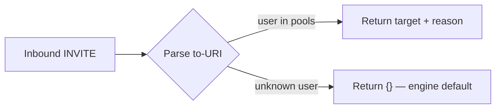

## Overview

This recipe builds a **production-style Rhai routing plugin**. It
implements the full `describe_capabilities()` + `route(req)` contract
the engine expects from a dialplan plugin.

By the end you will have:

1. A Rhai script that routes inbound SIP calls by parsing the `to` URI.
2. A lookup-table dialplan mapping user prefixes to queue targets.
3. A graceful fallthrough for unmatched calls.

## Prerequisites

- Completed the [Hello World](/cookbook/script/rhai/hello-world/) recipe.
- A running `smiths-net` instance.

## 1. Write the routing script

```rhai
// main.rhai
fn describe_capabilities() {
    [#{
        "capability": "routing.dialplan",
        "plugin": "canonical-hook-rhai",
        "model_id": "canonical-rhai-v1",
        "abi": "1.0",
        "description": "Rhai dialplan: routes SIP calls by to-URI prefix.",
        "priority": 50,
    }]
}

/// Route inbound calls by matching the `to` URI's user part
/// against a lookup table of known queue prefixes.
fn route(req) {
    let pools = #{
        "support":  "sip:queue-support@pbx.internal",
        "sales":    "sip:queue-sales@pbx.internal",
        "billing":  "sip:queue-billing@pbx.internal",
        "voicebot": "sip:voicebot@agents.internal",
    };

    let to_str = "";
    if req.contains("to") {
        to_str = req["to"];
    }
    if type_of(to_str) != "string" {
        to_str = "";
    }

    // Pull the user part from `sip:<user>@host`.
    let user = "";
    if to_str.starts_with("sip:") {
        let rest = to_str.sub_string(4);
        let at = rest.index_of("@");
        if at >= 0 {
            user = rest.sub_string(0, at);
        }
    }

    let target = ();
    if pools.contains(user) {
        target = pools[user];
    }

    if target == () {
        return #{};  // fall through to engine default
    }

    #{
        "target": target,
        "reason": "matched pool " + user,
    }
}
```

### How it works



| Step | Detail |
|------|--------|
| **1. Receive request** | Engine passes a map with `from`, `to`, `call_id`, `headers`. |
| **2. Extract user** | Parse `sip:<user>@host` from the `to` field. |
| **3. Lookup** | Check `user` against the `pools` map. |
| **4. Return** | If matched: `#{ target, reason }`. If not: empty map `#{}`. |

### Request / response shapes

**Input** (engine → plugin):

```json
{
  "from": "sip:alice@example.com",
  "to": "sip:support@smiths.local",
  "call_id": "abc123@smiths.local",
  "headers": {}
}
```

**Output** (plugin → engine):

```json
{
  "target": "sip:queue-support@pbx.internal",
  "reason": "matched pool support"
}
```

## 2. Create the manifest

```toml
# plugin.toml
name        = "canonical-hook-rhai"
version     = "0.1.0"
type        = "script"
entry       = "./main.rhai"
provides    = ["routing.dialplan"]
abi         = "1.0"
description = "Rhai dialplan — routes inbound SIP by to-URI user part."

script_max_operations = 200000
script_wall_clock_ms  = 50
```

### Safety budgets

| Limit | Value | Purpose |
|-------|-------|---------|
| `script_max_operations` | 200 000 | Prevents infinite loops from pinning a worker thread. |
| `script_wall_clock_ms` | 50 ms | Hard timeout — even if the script is busy, it's killed. |

The engine enforces both limits at runtime. If a script exceeds either,
the invocation fails with `ScriptBudgetExceeded` and the engine falls
through to the next provider.

## 3. Load and test

```bash
mkdir -p plugins/canonical-hook-rhai
cp main.rhai plugin.toml plugins/canonical-hook-rhai/
smiths-net --config config.toml
```

Test with a SIP call to `sip:support@smiths.local` — the logs should
show the routing decision:

```
INFO smiths_script: route matched target="sip:queue-support@pbx.internal" reason="matched pool support"
```

## Comparison with other tracks

| Feature | Script (Rhai) | WASM (Rust) | Sidecar (Python) |
|---------|:---:|:---:|:---:|
| Compilation | ✗ | ✓ | ✗ |
| Hot reload | ✓ instant | ✓ (re-load .wasm) | ✓ (restart process) |
| Sandbox | ops + time budgets | memory + fuel limits | OS process isolation |
| Performance | ~µs per call | ~ns per call | ~ms per call |
| Best for | Config-like routing | Tight loops, crypto | AI/ML, network I/O |

## Next steps

- Build a WASM version of the same logic — see
  [WASM Canonical Hook](/cookbook/wasm/rust/canonical-hook/).
- Add IVR state-machine logic with `on_dtmf()`.
- Explore the Sidecar track for Python-based plugins —
  [Python Hello World](/cookbook/sidecar/python/hello-world/).
