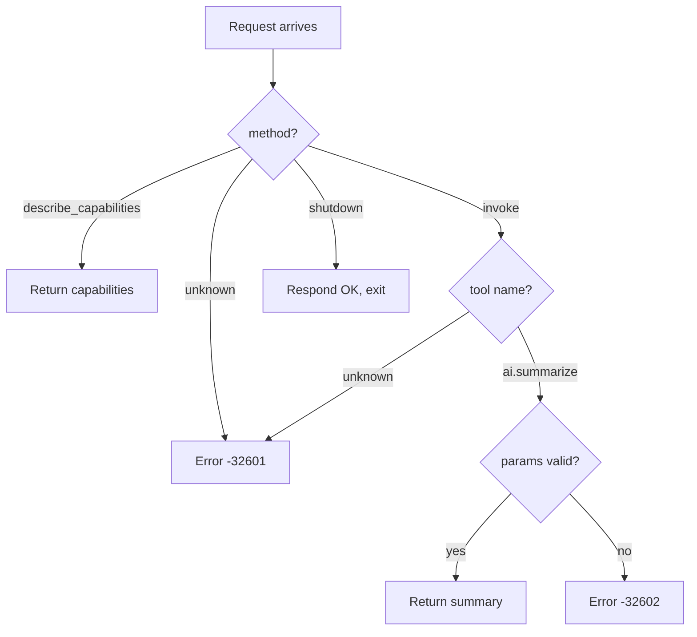

## Overview

This recipe builds a **production-style Node.js sidecar** that
implements the `ai.summarize` tool. It demonstrates the complete
sidecar contract: capability discovery, tool invocation with
parameter validation, and structured error responses.

By the end you will have:

1. A sidecar that advertises one tool via `describe_capabilities`.
2. Tool dispatch through the `invoke` method.
3. JSON-RPC error handling for missing params and unknown tools.

## Prerequisites

- Completed the [Hello World](/cookbook/sidecar/nodejs/hello-world/) recipe.
- Node.js ≥ 22.

## 1. The invoke pattern

Unlike the hello-world echo, production sidecars handle the `invoke`
method. The engine passes a `tool` name and `args` object:

```javascript
case "invoke": {
  const tool = params?.tool;
  if (tool === "ai.summarize") {
    invokeSummarize(id, params?.args ?? {});
  } else {
    respondError(id, -32601, `unknown tool: ${tool}`);
  }
  break;
}
```

## 2. Implement the tool

```javascript
function invokeSummarize(id, params) {
  const text = params?.text;
  if (typeof text !== "string") {
    respondError(id, -32602, "missing required param: text");
    return;
  }

  const maxLength = params?.max_length ?? 100;
  if (typeof maxLength !== "number" || maxLength < 1) {
    respondError(id, -32602, "max_length must be a positive integer");
    return;
  }

  const summary =
    text.length <= maxLength ? text : text.slice(0, maxLength) + "…";

  respond(id, { summary, original_length: text.length });
}
```

### Request / response shapes

**Success:**

```json
// Request
{"jsonrpc":"2.0","id":1,"method":"invoke","params":{"tool":"ai.summarize","args":{"text":"Long text...","max_length":20}}}

// Response
{"jsonrpc":"2.0","id":1,"result":{"summary":"Long text…","original_length":42}}
```

**Error (missing param):**

```json
// Response
{"jsonrpc":"2.0","id":1,"error":{"code":-32602,"message":"missing required param: text"}}
```

## 3. Test scenarios

```bash
node test_canonical_hook.mjs
```

| Test | Input | Expected |
|------|-------|----------|
| describe | `describe_capabilities` | name = `canonical-hook-nodejs` |
| summarize (long) | text 54 chars, max 20 | truncated with `…` |
| summarize (short) | text 6 chars | returned as-is |
| unknown tool | `unknown.tool` | error `-32601` |
| missing param | no `text` field | error `-32602` |
| unknown method | `nonsense` | error `-32601` |
| shutdown | `shutdown` | `{ok: true}`, exit 0 |

## Error handling pattern



## Next steps

- Compare with the Python canonical hook —
  [Python Canonical Hook](/cookbook/sidecar/python/canonical-hook/).
- Try the WASM track for zero-dependency plugins —
  [WASM Hello World](/cookbook/wasm/rust/hello-world/).
- Explore the Script track for hot-reloadable logic —
  [Rhai Hello World](/cookbook/script/rhai/hello-world/).
