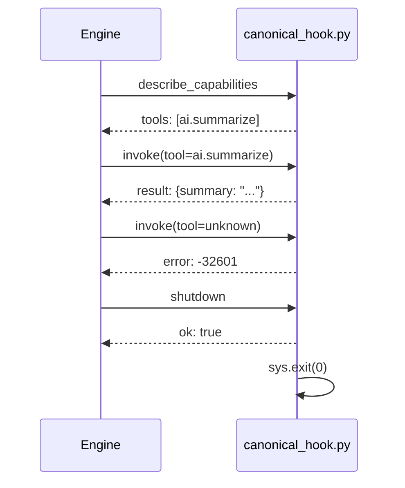

## Overview

A production sidecar plugin implements three JSON-RPC 2.0 methods:

| Method                   | Direction       | Purpose                    |
|--------------------------|-----------------|----------------------------|
| `describe_capabilities`  | Engine → Plugin | Declare plugin metadata and tools |
| `invoke`                 | Engine → Plugin | Execute a tool by name     |
| `shutdown`               | Engine → Plugin | Graceful exit signal       |

This recipe builds a complete implementation that exposes an
`ai.summarize` tool — a naive extractive summariser that takes text
and returns the first N sentences.

## Prerequisites

- Completed the [Hello World](/cookbook/sidecar/python/hello-world/) recipe
- Familiarity with `plugin.toml` manifests
- Python 3.11+

## Protocol reference

Every frame is **JSON-RPC 2.0**, newline-delimited on stdin/stdout.

### `describe_capabilities`

The engine calls this immediately after spawning. Return the plugin
name, version, and a list of tool descriptors:

```json
// Engine → Plugin
{"jsonrpc":"2.0","id":1,"method":"describe_capabilities","params":{}}

// Plugin → Engine
{"jsonrpc":"2.0","id":1,"result":{
  "name":"canonical-hook-py",
  "version":"0.1.0",
  "tools":[{
    "name":"ai.summarize",
    "description":"Summarize a block of text.",
    "parameters":{
      "type":"object",
      "properties":{
        "text":{"type":"string"},
        "max_sentences":{"type":"integer","default":3}
      },
      "required":["text"]
    }
  }]
}}
```

### `invoke`

The engine routes tool calls here. `params.tool` names the tool;
`params.args` carries the tool's input:

```json
// Engine → Plugin
{"jsonrpc":"2.0","id":2,"method":"invoke","params":{
  "tool":"ai.summarize",
  "args":{"text":"First. Second. Third. Fourth.","max_sentences":2}
}}

// Plugin → Engine (success)
{"jsonrpc":"2.0","id":2,"result":{"summary":"First. Second."}}

// Plugin → Engine (error — unknown tool)
{"jsonrpc":"2.0","id":2,"error":{"code":-32601,"message":"unknown tool: foo"}}
```

### `shutdown`

The engine sends this before killing the child. Respond with `ok`
and exit:

```json
// Engine → Plugin
{"jsonrpc":"2.0","id":3,"method":"shutdown","params":{}}

// Plugin → Engine
{"jsonrpc":"2.0","id":3,"result":{"ok":true}}
// then sys.exit(0)
```

### Error codes

| Code    | Meaning           | When to use                     |
|---------|-------------------|---------------------------------|
| `-32601` | Method not found  | Unknown method or unknown tool |
| `-32602` | Invalid params    | Missing required fields         |
| `-32603` | Internal error    | Unexpected exception            |

## The complete plugin

Create `canonical_hook.py`:

```python
#!/usr/bin/env python3
"""
Canonical sidecar plugin for Smiths-Net.

Implements the full JSON-RPC 2.0 sidecar protocol:
  - describe_capabilities  → declare tools
  - invoke                 → execute a tool by name
  - shutdown               → clean exit

Exposes a single tool: ai.summarize
"""

from __future__ import annotations

import json
import sys
from typing import Any


# ── JSON-RPC helpers ────────────────────────────────────

def send(obj: dict[str, Any]) -> None:
    """Write one JSON-RPC frame + newline to stdout, then flush."""
    sys.stdout.write(json.dumps(obj, separators=(",", ":")) + "\n")
    sys.stdout.flush()


def respond(req_id: int, result: Any) -> None:
    """Send a JSON-RPC success response."""
    send({"jsonrpc": "2.0", "id": req_id, "result": result})


def respond_error(req_id: int, code: int, message: str) -> None:
    """Send a JSON-RPC error response."""
    send({
        "jsonrpc": "2.0",
        "id": req_id,
        "error": {"code": code, "message": message},
    })


# ── Tool descriptors ───────────────────────────────────

TOOLS = [
    {
        "name": "ai.summarize",
        "description": "Summarize a block of text into a few sentences.",
        "parameters": {
            "type": "object",
            "properties": {
                "text": {
                    "type": "string",
                    "description": "The text to summarize.",
                },
                "max_sentences": {
                    "type": "integer",
                    "description": "Maximum sentences in the summary.",
                    "default": 3,
                },
            },
            "required": ["text"],
        },
    }
]

_TOOL_MAP: dict[str, dict] = {t["name"]: t for t in TOOLS}


# ── Tool implementations ───────────────────────────────

def summarize(text: str, max_sentences: int = 3) -> str:
    """Naive extractive summariser — split on period, take first N."""
    sentences = [s.strip() for s in text.split(".") if s.strip()]
    if not sentences:
        return ""
    return ". ".join(sentences[:max_sentences]) + "."


# ── RPC handlers ───────────────────────────────────────

def handle_describe_capabilities(req_id: int, _params: Any) -> None:
    respond(req_id, {
        "name": "canonical-hook-py",
        "version": "0.1.0",
        "tools": TOOLS,
    })


def handle_invoke(req_id: int, params: Any) -> None:
    if not isinstance(params, dict):
        respond_error(req_id, -32602, "params must be an object")
        return

    tool_name = params.get("tool")
    if not tool_name:
        respond_error(req_id, -32602, "missing 'tool' in params")
        return

    if tool_name not in _TOOL_MAP:
        respond_error(req_id, -32601, f"unknown tool: {tool_name}")
        return

    args = params.get("args", {})

    if tool_name == "ai.summarize":
        text = args.get("text", "")
        max_sentences = args.get("max_sentences", 3)
        summary = summarize(text, max_sentences)
        respond(req_id, {"summary": summary})
    else:
        respond_error(req_id, -32601, f"unimplemented tool: {tool_name}")


def handle_shutdown(req_id: int, _params: Any) -> None:
    respond(req_id, {"ok": True})
    sys.exit(0)


# ── Dispatch table ─────────────────────────────────────

HANDLERS: dict[str, Any] = {
    "describe_capabilities": handle_describe_capabilities,
    "invoke": handle_invoke,
    "shutdown": handle_shutdown,
}


# ── Main loop ──────────────────────────────────────────

def main() -> None:
    for line in sys.stdin:
        line = line.strip()
        if not line:
            continue

        try:
            request = json.loads(line)
        except json.JSONDecodeError:
            print(f"bad frame: {line!r}", file=sys.stderr)
            continue

        req_id = request.get("id")
        method = request.get("method", "")

        handler = HANDLERS.get(method)
        if handler:
            handler(req_id, request.get("params", {}))
        else:
            respond_error(req_id, -32601, f"method not found: {method}")


if __name__ == "__main__":
    main()
```

### Architecture at a glance

| Layer            | Responsibility                                     |
|------------------|-----------------------------------------------------|
| `send()`         | Serialise + flush one JSON-RPC frame                |
| `respond()`      | Build success envelope → `send()`                   |
| `respond_error()`| Build error envelope → `send()`                     |
| `HANDLERS` dict  | Method name → handler function dispatch             |
| `_TOOL_MAP` dict | Tool name → descriptor (for validation)             |
| `handle_invoke()`| Validates params, looks up tool, calls implementation |
| `summarize()`    | The actual tool logic — easily replaceable           |

> **Adding a new tool** — define its descriptor in `TOOLS`, add an
> `elif` branch in `handle_invoke()`, and implement the function.
> That's it.

## Plugin manifest

```toml
# plugin.toml — Sidecar plugin manifest for canonical-hook-py.
name        = "canonical-hook-py"
version     = "0.1.0"
type        = "sidecar"
entry       = "./canonical_hook.py"
provides    = ["ai.summarize"]
description = "Full sidecar protocol: describe + invoke + shutdown."

[sidecar]
command = "python3"
args    = ["canonical_hook.py"]
```

The `provides` array declares which tools this plugin exposes. The
engine uses it for routing — when an MCP client calls `ai.summarize`,
the engine knows to dispatch to this sidecar.

## Test the lifecycle

The test exercises the full describe → invoke → shutdown sequence
without the engine:

```python
#!/usr/bin/env python3
"""Subprocess test for canonical_hook.py — no engine required."""

import json
import subprocess
import sys
from pathlib import Path

SCRIPT = Path(__file__).parent / "canonical_hook.py"


def start():
    return subprocess.Popen(
        [sys.executable, str(SCRIPT)],
        stdin=subprocess.PIPE, stdout=subprocess.PIPE,
        stderr=subprocess.PIPE, text=True,
    )


def rpc(proc, req_id, method, params=None):
    request = {"jsonrpc": "2.0", "id": req_id, "method": method, "params": params or {}}
    proc.stdin.write(json.dumps(request) + "\n")
    proc.stdin.flush()
    line = proc.stdout.readline()
    assert line, f"expected response for {method}, got EOF"
    return json.loads(line)


def test_full_lifecycle():
    proc = start()

    # 1. describe
    r1 = rpc(proc, 1, "describe_capabilities")
    assert r1["result"]["tools"][0]["name"] == "ai.summarize"

    # 2. invoke
    r2 = rpc(proc, 2, "invoke", {
        "tool": "ai.summarize",
        "args": {"text": "Hello world. Goodbye world.", "max_sentences": 1},
    })
    assert r2["result"]["summary"] == "Hello world."

    # 3. error — unknown tool
    r3 = rpc(proc, 3, "invoke", {"tool": "nonexistent"})
    assert r3["error"]["code"] == -32601

    # 4. shutdown
    r4 = rpc(proc, 4, "shutdown")
    assert r4["result"]["ok"] is True
    assert proc.wait(timeout=5) == 0

    print("✓ full lifecycle passed")


if __name__ == "__main__":
    test_full_lifecycle()
```

Run it:

```bash
python3 test_canonical_hook.py
```

## What happens at runtime



## Next steps

- Add a real NLP backend (e.g. `transformers` pipeline) to `summarize()`
- Add streaming output via notifications — see `PluginNotification` in the engine
- See the [WASM Rust Canonical Hook](/cookbook/wasm/rust/canonical-hook/)
  for the in-process alternative
