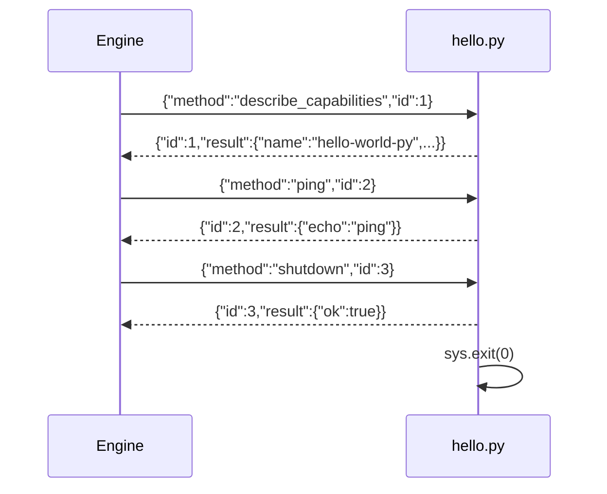

## Overview

Sidecar plugins run as **child processes** of the engine. They
communicate over a **JSON-RPC 2.0** protocol on stdin / stdout
(newline-delimited). This is the simplest path when you want to use
Python libraries (e.g. `transformers`, `whisper`, `numpy`) without
compiling to WASM.

By the end of this recipe you will have:

1. A Python script that handles JSON-RPC requests.
2. A `plugin.toml` manifest the engine reads at boot.
3. A subprocess test that exercises the contract without the engine.

## Prerequisites

- Python 3.11+
- A running `smiths-net` instance — the quickest way is:

```bash
smiths-net init --preset dev --non-interactive
smiths-net --config config.toml
```

## The protocol

The engine sends newline-delimited JSON-RPC 2.0 requests on stdin.
The plugin replies with one JSON line per request on stdout.

| Direction          | Frame shape |
|--------------------|-------------|
| Engine → Plugin    | `{"jsonrpc":"2.0","id":1,"method":"...","params":{}}` |
| Plugin → Engine    | `{"jsonrpc":"2.0","id":1,"result":{...}}` |
| Plugin → Engine    | `{"jsonrpc":"2.0","id":1,"error":{"code":-1,"message":"..."}}` |

Key rules:

- Every request carries a **monotonic `id`**; the response must echo it.
- `result` and `error` are mutually exclusive.
- A frame without `id` is a **notification** (plugin-initiated event).
- The engine calls `"shutdown"` before killing the child; respond and exit.

## Write the plugin

Create `hello.py`:

```python
#!/usr/bin/env python3
"""
Minimal sidecar plugin for Smiths-Net.

Speaks JSON-RPC 2.0 over stdin/stdout (newline-delimited).
The engine sends requests; this script replies.
"""

from __future__ import annotations

import json
import sys
from typing import Any


def send(obj: dict[str, Any]) -> None:
    """Write one JSON-RPC frame + newline to stdout, then flush."""
    sys.stdout.write(json.dumps(obj, separators=(",", ":")) + "\n")
    sys.stdout.flush()


def respond(req_id: int, result: Any) -> None:
    """Send a success response for the given request id."""
    send({"jsonrpc": "2.0", "id": req_id, "result": result})


def respond_error(req_id: int, code: int, message: str) -> None:
    """Send an error response for the given request id."""
    send({"jsonrpc": "2.0", "id": req_id, "error": {"code": code, "message": message}})


def handle(request: dict[str, Any]) -> None:
    """Dispatch one incoming JSON-RPC request."""
    req_id = request.get("id")
    method = request.get("method", "")

    if method == "describe_capabilities":
        respond(req_id, {
            "name": "hello-world-py",
            "version": "0.1.0",
            "capabilities": [],
        })
    elif method == "shutdown":
        respond(req_id, {"ok": True})
        sys.exit(0)
    else:
        # Echo the method name back — proof the plugin is alive.
        respond(req_id, {"echo": method})


def main() -> None:
    """Read JSON-RPC requests from stdin, dispatch each one."""
    for line in sys.stdin:
        line = line.strip()
        if not line:
            continue
        try:
            request = json.loads(line)
        except json.JSONDecodeError:
            print(f"bad frame: {line!r}", file=sys.stderr)
            continue
        handle(request)


if __name__ == "__main__":
    main()
```

### What each function does

| Function | Purpose |
|----------|---------|
| `send()` | Serialises a dict to JSON + newline, flushes stdout |
| `respond()` | Builds a success frame and calls `send()` |
| `respond_error()` | Builds an error frame (not used here, but ready) |
| `handle()` | Routes by method name — `describe_capabilities`, `shutdown`, or echo |
| `main()` | Blocking read loop over stdin, one JSON-RPC frame per line |

> **Why `flush()`?** The engine reads stdout with `BufReader::lines()`.
> Without an explicit flush, Python's output buffering may hold the
> response until the buffer fills — the engine would time out waiting.

## Plugin manifest

Create `plugin.toml` alongside your script:

```toml
# plugin.toml — Sidecar plugin manifest for hello-world-py.
name        = "hello-world-py"
version     = "0.1.0"
type        = "sidecar"
entry       = "./hello.py"
description = "Minimal Python sidecar plugin — echoes method names."

[sidecar]
command = "python3"
args    = ["hello.py"]
```

| Field | Description |
|-------|-------------|
| `name` | Unique plugin identifier |
| `type` | Must be `"sidecar"` — tells the engine to spawn a child process |
| `entry` | Path to the script, relative to the plugin directory |
| `sidecar.command` | The interpreter binary |
| `sidecar.args` | Arguments passed after the command |

## Test without the engine

You can exercise the JSON-RPC contract as a pure subprocess test:

```python
#!/usr/bin/env python3
"""Subprocess test for hello.py — no engine required."""

import json
import subprocess
import sys
from pathlib import Path

SCRIPT = Path(__file__).parent / "hello.py"


def rpc(proc, req_id: int, method: str, params=None) -> dict:
    """Send one JSON-RPC request and read the response."""
    request = {
        "jsonrpc": "2.0",
        "id": req_id,
        "method": method,
        "params": params or {},
    }
    proc.stdin.write(json.dumps(request) + "\n")
    proc.stdin.flush()
    line = proc.stdout.readline()
    assert line, f"expected response for {method}, got EOF"
    return json.loads(line)


def test_describe():
    proc = subprocess.Popen(
        [sys.executable, str(SCRIPT)],
        stdin=subprocess.PIPE, stdout=subprocess.PIPE,
        stderr=subprocess.PIPE, text=True,
    )
    try:
        resp = rpc(proc, 1, "describe_capabilities")
        assert resp["result"]["name"] == "hello-world-py"
        print("✓ describe_capabilities")
    finally:
        proc.terminate()
        proc.wait()


def test_echo():
    proc = subprocess.Popen(
        [sys.executable, str(SCRIPT)],
        stdin=subprocess.PIPE, stdout=subprocess.PIPE,
        stderr=subprocess.PIPE, text=True,
    )
    try:
        resp = rpc(proc, 2, "some_method")
        assert resp["result"]["echo"] == "some_method"
        print("✓ echo")
    finally:
        proc.terminate()
        proc.wait()


def test_shutdown():
    proc = subprocess.Popen(
        [sys.executable, str(SCRIPT)],
        stdin=subprocess.PIPE, stdout=subprocess.PIPE,
        stderr=subprocess.PIPE, text=True,
    )
    resp = rpc(proc, 3, "shutdown")
    assert resp["result"]["ok"] is True
    assert proc.wait(timeout=5) == 0
    print("✓ shutdown")


if __name__ == "__main__":
    test_describe()
    test_echo()
    test_shutdown()
    print("\nAll tests passed.")
```

Run it:

```bash
python3 test_hello.py
```

Expected output:

```plaintext
✓ describe_capabilities
✓ echo
✓ shutdown

All tests passed.
```

## Load into the engine

```bash
mkdir -p plugins/hello-world-py
cp hello.py plugin.toml plugins/hello-world-py/
smiths-net reload
```

Check the engine logs — you should see `sidecar spawned` with
`plugin = "hello-world-py"`.

## What happens at runtime



## Next steps

- Implement `describe` and `invoke` handlers — see the
  [Canonical Hook](/cookbook/sidecar/python/canonical-hook/) recipe.
- Add sandboxing with `rlimit` and `no_new_privs` — see
  the operator runbook's sidecar section.
