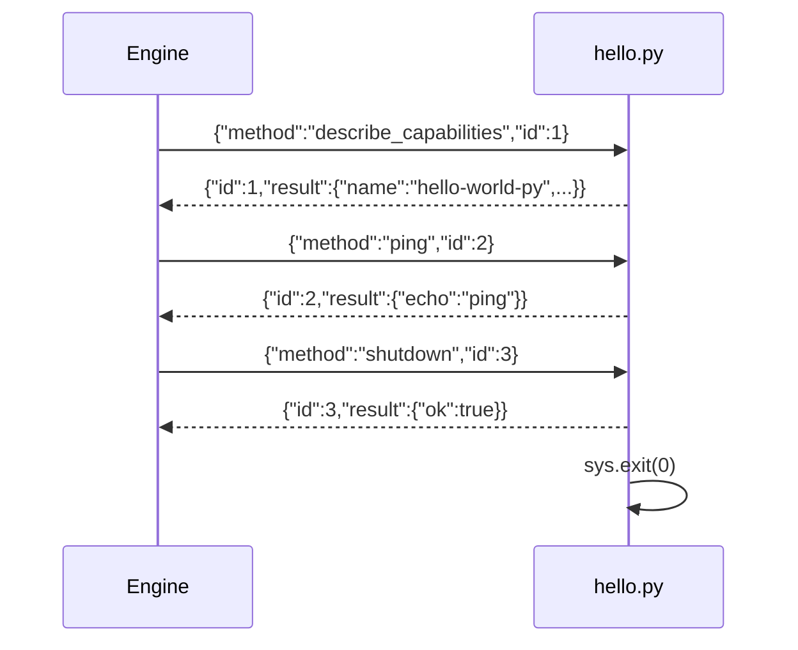

## Обзор

Sidecar плагины запускаются как **дочерние процессы** движка. Они
общаются по протоколу **JSON-RPC 2.0** через stdin/stdout
(по одной JSON строке на сообщение). Это самый простой путь, если
вы хотите использовать Python библиотеки (напр. `transformers`,
`whisper`, `numpy`) без компиляции в WASM.

К концу этого рецепта у вас будет:

1. Python скрипт, обрабатывающий JSON-RPC запросы.
2. Манифест `plugin.toml`, который движок читает при загрузке.
3. Тест подпроцесса, проверяющий контракт без запуска движка.

## Предварительные требования

- Python 3.11+
- Запущенный экземпляр `smiths-net` — быстрый старт:

```bash
smiths-net init --preset dev --non-interactive
smiths-net --config config.toml
```

## Протокол

Движок отправляет JSON-RPC 2.0 запросы через stdin (по одной строке).
Плагин отвечает одной JSON строкой на каждый запрос через stdout.

| Направление        | Формат фрейма |
|--------------------|---------------|
| Движок → Плагин    | `{"jsonrpc":"2.0","id":1,"method":"...","params":{}}` |
| Плагин → Движок    | `{"jsonrpc":"2.0","id":1,"result":{...}}` |
| Плагин → Движок    | `{"jsonrpc":"2.0","id":1,"error":{"code":-1,"message":"..."}}` |

Ключевые правила:

- Каждый запрос содержит **монотонный `id`**; ответ должен его повторить.
- `result` и `error` взаимоисключающие.
- Фрейм без `id` — это **нотификация** (событие от плагина).
- Движок вызывает `"shutdown"` перед завершением дочернего процесса; ответьте и завершите работу.

## Код плагина

Создайте `hello.py`:

```python
#!/usr/bin/env python3
"""
Minimal sidecar plugin for Smiths-Net.

Speaks JSON-RPC 2.0 over stdin/stdout (newline-delimited).
The engine sends requests; this script replies.
"""

from __future__ import annotations

import json
import sys
from typing import Any


def send(obj: dict[str, Any]) -> None:
    """Write one JSON-RPC frame + newline to stdout, then flush."""
    sys.stdout.write(json.dumps(obj, separators=(",", ":")) + "\n")
    sys.stdout.flush()


def respond(req_id: int, result: Any) -> None:
    """Send a success response for the given request id."""
    send({"jsonrpc": "2.0", "id": req_id, "result": result})


def respond_error(req_id: int, code: int, message: str) -> None:
    """Send an error response for the given request id."""
    send({"jsonrpc": "2.0", "id": req_id, "error": {"code": code, "message": message}})


def handle(request: dict[str, Any]) -> None:
    """Dispatch one incoming JSON-RPC request."""
    req_id = request.get("id")
    method = request.get("method", "")

    if method == "describe_capabilities":
        respond(req_id, {
            "name": "hello-world-py",
            "version": "0.1.0",
            "capabilities": [],
        })
    elif method == "shutdown":
        respond(req_id, {"ok": True})
        sys.exit(0)
    else:
        # Echo the method name back — proof the plugin is alive.
        respond(req_id, {"echo": method})


def main() -> None:
    """Read JSON-RPC requests from stdin, dispatch each one."""
    for line in sys.stdin:
        line = line.strip()
        if not line:
            continue
        try:
            request = json.loads(line)
        except json.JSONDecodeError:
            print(f"bad frame: {line!r}", file=sys.stderr)
            continue
        handle(request)


if __name__ == "__main__":
    main()
```

### Описание функций

| Функция | Назначение |
|---------|------------|
| `send()` | Сериализует dict в JSON + перевод строки, сбрасывает буфер stdout |
| `respond()` | Формирует фрейм успешного ответа и вызывает `send()` |
| `respond_error()` | Формирует фрейм ошибки (здесь не используется, но готов) |
| `handle()` | Маршрутизирует по имени метода — `describe_capabilities`, `shutdown` или echo |
| `main()` | Блокирующий цикл чтения stdin, один JSON-RPC фрейм на строку |

> **Почему `flush()`?** Движок читает stdout через `BufReader::lines()`.
> Без явного flush буферизация Python может задержать ответ до заполнения
> буфера — движок бы завершил ожидание по таймауту.

## Манифест плагина

Создайте `plugin.toml` рядом со скриптом:

```toml
# plugin.toml — Sidecar plugin manifest for hello-world-py.
name        = "hello-world-py"
version     = "0.1.0"
type        = "sidecar"
entry       = "./hello.py"
description = "Minimal Python sidecar plugin — echoes method names."

[sidecar]
command = "python3"
args    = ["hello.py"]
```

| Поле | Описание |
|------|----------|
| `name` | Уникальный идентификатор плагина |
| `type` | Должен быть `"sidecar"` — указывает движку запустить дочерний процесс |
| `entry` | Путь к скрипту относительно директории плагина |
| `sidecar.command` | Бинарник интерпретатора |
| `sidecar.args` | Аргументы, передаваемые после команды |

## Тестирование без движка

Вы можете проверить JSON-RPC контракт как чистый subprocess тест:

```python
#!/usr/bin/env python3
"""Subprocess test for hello.py — no engine required."""

import json
import subprocess
import sys
from pathlib import Path

SCRIPT = Path(__file__).parent / "hello.py"


def rpc(proc, req_id: int, method: str, params=None) -> dict:
    """Send one JSON-RPC request and read the response."""
    request = {
        "jsonrpc": "2.0",
        "id": req_id,
        "method": method,
        "params": params or {},
    }
    proc.stdin.write(json.dumps(request) + "\n")
    proc.stdin.flush()
    line = proc.stdout.readline()
    assert line, f"expected response for {method}, got EOF"
    return json.loads(line)


def test_describe():
    proc = subprocess.Popen(
        [sys.executable, str(SCRIPT)],
        stdin=subprocess.PIPE, stdout=subprocess.PIPE,
        stderr=subprocess.PIPE, text=True,
    )
    try:
        resp = rpc(proc, 1, "describe_capabilities")
        assert resp["result"]["name"] == "hello-world-py"
        print("✓ describe_capabilities")
    finally:
        proc.terminate()
        proc.wait()


def test_echo():
    proc = subprocess.Popen(
        [sys.executable, str(SCRIPT)],
        stdin=subprocess.PIPE, stdout=subprocess.PIPE,
        stderr=subprocess.PIPE, text=True,
    )
    try:
        resp = rpc(proc, 2, "some_method")
        assert resp["result"]["echo"] == "some_method"
        print("✓ echo")
    finally:
        proc.terminate()
        proc.wait()


def test_shutdown():
    proc = subprocess.Popen(
        [sys.executable, str(SCRIPT)],
        stdin=subprocess.PIPE, stdout=subprocess.PIPE,
        stderr=subprocess.PIPE, text=True,
    )
    resp = rpc(proc, 3, "shutdown")
    assert resp["result"]["ok"] is True
    assert proc.wait(timeout=5) == 0
    print("✓ shutdown")


if __name__ == "__main__":
    test_describe()
    test_echo()
    test_shutdown()
    print("\nAll tests passed.")
```

Запустите:

```bash
python3 test_hello.py
```

Ожидаемый результат:

```plaintext
✓ describe_capabilities
✓ echo
✓ shutdown

All tests passed.
```

## Загрузка в движок

```bash
mkdir -p plugins/hello-world-py
cp hello.py plugin.toml plugins/hello-world-py/
smiths-net reload
```

Проверьте логи движка — вы должны увидеть `sidecar spawned` с
`plugin = "hello-world-py"`.

## Что происходит во время работы



## Следующие шаги

- Реализуйте обработчики `describe` и `invoke` — см. рецепт
  [Canonical Hook](/cookbook/sidecar/python/canonical-hook/).
- Добавьте песочницу с `rlimit` и `no_new_privs` — см.
  раздел sidecar в операционном руководстве.
