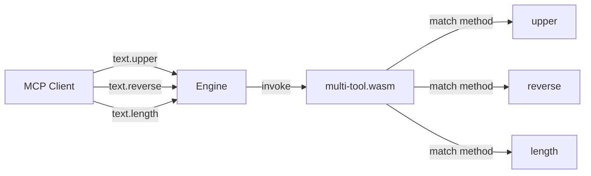

## Overview

This recipe shows how a **single WASM plugin** can expose **multiple
tools** through the `describe` + `invoke` ABI. The engine's MCP server
presents each tool as a separate callable endpoint.

By the end you will have:

1. A WASM plugin that registers three text-processing tools.
2. A `describe()` that returns an **array** of capability descriptors.
3. An `invoke()` dispatcher that routes by method name.

## Prerequisites

- Completed the [Canonical Hook](/cookbook/wasm/rust/canonical-hook/) recipe.
- Rust toolchain with `wasm32-unknown-unknown`.

## 1. Describe multiple capabilities

The key difference from single-tool plugins: `describe()` returns a
**JSON array** instead of a single object:

```rust
static DESCRIBE_JSON: &[u8] = br#"[
  {"capability":"text.upper",  "plugin":"multi-tool","abi":"1.0","description":"Convert to UPPERCASE."},
  {"capability":"text.reverse","plugin":"multi-tool","abi":"1.0","description":"Reverse a string."},
  {"capability":"text.length", "plugin":"multi-tool","abi":"1.0","description":"Return byte length."}
]"#;
```

The engine parses this array and registers **three separate tools**,
all backed by the same WASM module.

## 2. Dispatch by method name

The `invoke()` function receives the method name and must route to
the correct handler:

```rust
#[unsafe(no_mangle)]
pub extern "C" fn invoke(
    method_ptr: i32,
    method_len: i32,
    params_ptr: i32,
    params_len: i32,
) -> i64 {
    let method = unsafe {
        core::slice::from_raw_parts(
            method_ptr as *const u8,
            method_len as usize,
        )
    };
    let params = unsafe {
        core::slice::from_raw_parts(
            params_ptr as *const u8,
            params_len as usize,
        )
    };

    let input = extract_input(params);

    let result = match method {
        b"text.upper"   => upper(input),
        b"text.reverse" => reverse(input),
        b"text.length"  => length(input),
        _               => build_error(b"unknown tool"),
    };

    let ptr = result.as_ptr() as u32 as i64;
    let len = result.len() as u32 as i64;
    (ptr << 32) | len
}
```

### Tool implementations

Each tool reads from the `input` parameter and writes a JSON
response into the shared `RESPONSE` buffer:

| Tool | Input | Output |
|------|-------|--------|
| `text.upper` | `{"input":"hello"}` | `{"result":"HELLO"}` |
| `text.reverse` | `{"input":"hello"}` | `{"result":"olleh"}` |
| `text.length` | `{"input":"hello"}` | `{"result":5}` |

## 3. Build and load

```bash
cargo build --target wasm32-unknown-unknown --release
```

```toml
# plugin.toml
name        = "multi-tool"
version     = "0.1.0"
type        = "wasm"
entry       = "./multi_tool.wasm"
provides    = ["text.upper", "text.reverse", "text.length"]
permissions = []
abi         = "1.0"
description = "Multi-tool WASM plugin: uppercase, reverse, and length."
```

## Architecture



## Key takeaways

1. **One module, many tools** — reduces loading overhead vs. separate
   plugins for each function.
2. **Array describe** — the engine handles both single-object and
   array descriptors; use arrays for multi-tool plugins.
3. **Shared buffer** — all tools write to the same `RESPONSE` static.
   This is fine because WASM is single-threaded.

## Next steps

- Add error handling patterns — see the
  [Error Handling](/cookbook/wasm/rust/error-handling/) recipe.
- Explore sidecar plugins for when you need external dependencies —
  [Python Hello World](/cookbook/sidecar/python/hello-world/).
